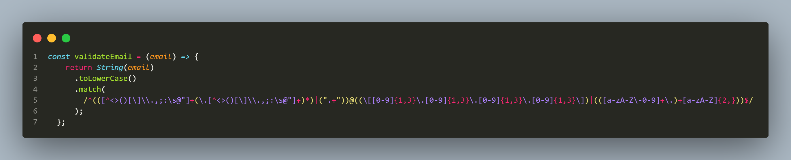

# Frontend Mentor - Ping coming soon page solution

A solution to the Ping Landing page coding challenge from Frontend Mentor with client side email validation.. 

## Table of contents

- [Overview](#overview)
  - [The challenge](#the-challenge)
  - [Screenshot](#screenshot)
  - [Links](#links)
- [My process](#my-process)
  - [Built with](#built-with)
  - [What I learned](#what-i-learned)
  - [Continued development](#continued-development)
  - [Useful resources](#useful-resources)
- [Author](#author)

**Note: Delete this note and update the table of contents based on what sections you keep.**

## Overview

### The challenge

Users should be able to:

- View the optimal layout for the site depending on their device's screen size
- See hover states for all interactive elements on the page
- Submit their email address using an `input` field
- Receive an error message when the `form` is submitted if:
	- The `input` field is empty. The message for this error should say *"Whoops! It looks like you forgot to add your email"*
	- The email address is not formatted correctly (i.e. a correct email address should have this structure: `name@host.tld`). The message for this error should say *"Please provide a valid email address"*

### Screenshot


### Links

- Solution URL: [Add solution URL here](https://your-solution-url.com)
- Live Site URL: [Add live site URL here](https://your-live-site-url.com)

## My process

### Built with

- Semantic HTML5 markup
- CSS custom properties
- Flexbox
- CSS Grid
- Desktop-first workflow
- Email Validation using Regex
- Vanilla Javascript


### What I learned

I finally learnt how to properly implement email validation using the regex method. 

In doing this, a function is created where the invalid(unwanted) charecters and valid(acceptable) characters in a email are defined. Another function is created to check the input value of the email and is then matched with the character defined earlier and an if-else statement is used to check if they match with the accepted characters. If it matches, the form submission will be successful, else it will throw an error message.

This is the code snippet I used below:

```js
const validateEmail = (email) => {
    return String(email)
      .toLowerCase()
      .match(
        /^(([^<>()[\]\\.,;:\s@"]+(\.[^<>()[\]\\.,;:\s@"]+)*)|(".+"))@((\[[0-9]{1,3}\.[0-9]{1,3}\.[0-9]{1,3}\.[0-9]{1,3}\])|(([a-zA-Z\-0-9]+\.)+[a-zA-Z]{2,}))$/
      );
  };


function checkEmail(e) {
    e.preventDefault();
    const email = e.target.querySelector('input[type="email"]').value;

    if (validateEmail(email)) {
        
    } else {
       
    };
}
}
```

I really love this regex code snippet.
let me save it here in a picture format.


### Continued development

I will practice more of Javascript form validation, not only with the email, but other frequently used form validation, like password, phone number etc.


### Useful resources

- [Stack Overflow](https://www.example.com) - This helped me in getiing the proper code for the implementation of the email validation using regex. I really liked this pattern and will use it going forward.


## Author

- Website - [Ovie Nathaniel On LinkedIn](https://www.linkedin.com/in/ovie-nathaniel/)
- Frontend Mentor - [@ovie-best](https://www.frontendmentor.io/profile/ovie-best)
- Twitter - [@oviebest_2](https://twitter.com/oviebest_2)
